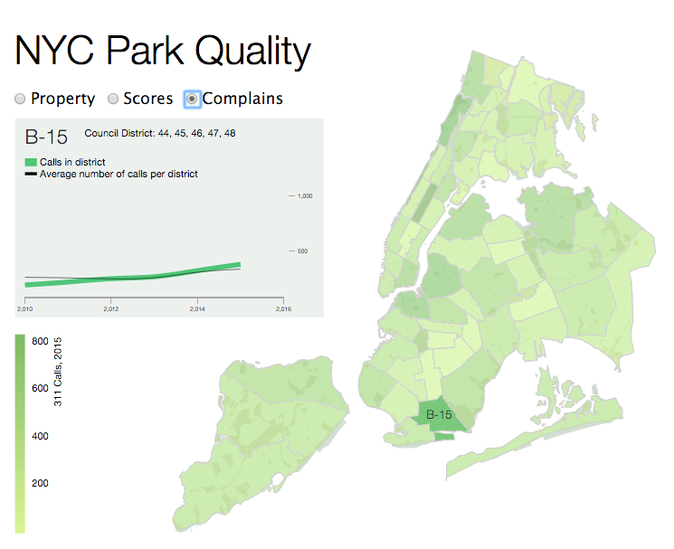

Parqa_tool
==========
**geoVis for Parqa project**

*Current state snapshot*

## start server (cant remember)

- `http-server -p 8008 &`

##WISHES (this will be removed lately)

- nice and fast background with park_districts layout
- infopanel on howering
- filtering/serching for properties
- show list of all amenities, recent grades, area and assets coefficients
- show timeseries on selected district and/or park
- time-filtering
- quality-based color ramp

##TODO

- [x] basic district visualisation
- [x] District id as hover-window
- [x] District card on hover/select
	- [x] show card
	- [ ] add data (population, area, park area, tbd)
- [x] mode radiobutton
- [x] draw parks
- [x] css to separate file
- [x] js to separate file
- [x] districts over parks
- [x] switch to modes
- [x] add choropleth data to districts (calls and soph. score for 2015)
- [x] added calls and score to district card
- [x] choropleth
- [X] cure choropleth (grey things)
- [X] choropleth legend
- [ ] work on color palletes
- [X] timelines
- [ ] selection
- [X] optimize parks (remove small ones/convert to points)
- [X] design park card

- [ ] draw other properties
- [ ] filters (years, type, borough)

##LastTODO

- [ ] move district labels to improve visibility
- [ ] create additional selector hotspots

##Known Bugs
- [x] for now parks are above districts: therefore, it's fruitless to hover over the park

##LINKS

- [static cubism](http://bl.ocks.org/bae25/10797393)
- [cubism api](https://github.com/square/cubism/wiki/Metric)
- [mapbox mapGL](https://github.com/mapbox/mapbox-gl-js)
- [cartodb.js](http://docs.cartodb.com/cartodb-platform/cartodb-js.html)
- [d3.js](http://d3js.org/)
